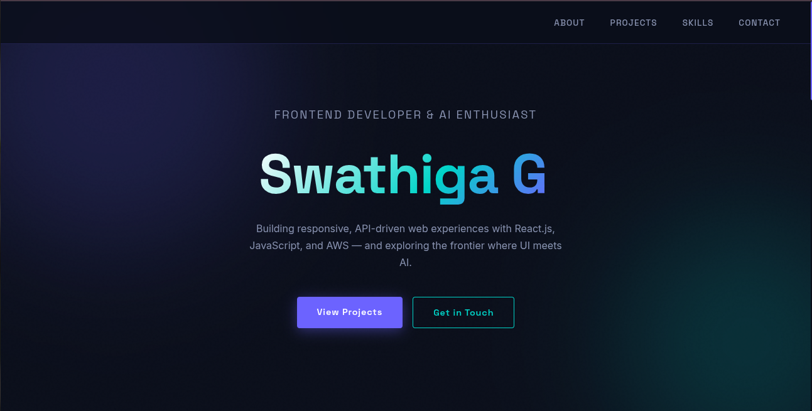
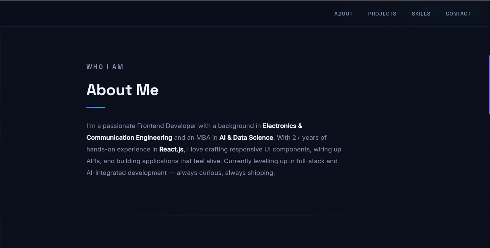

### Portfolio Challenge

Build a portfolio that showcases your skills and demonstrates your understanding of HTML, CSS, and JavaScript through code.

Instead of simply following tutorials, try to design your own portfolio or recreate a portfolio that inspires you. Focus on writing clean, responsive, and well-structured code.

You can refer to the code in this repository if you need guidance, but challenge yourself to build it on your own first.

A portfolio is one of the first things recruiters and interviewers look at, and many job applications require a portfolio link. A well-crafted portfolio not only highlights your projects but also reflects your frontend development skills and attention to detail.

## Screenshot

